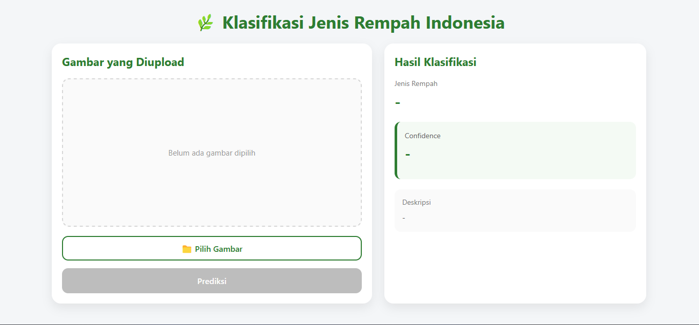
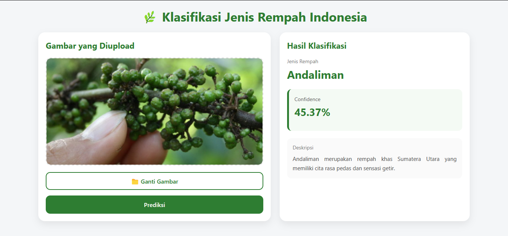

# Klasifikasi Jenis Rempah Indonesia Menggunakan MobileNetV2
Aplikasi berbasis web untuk mengklasifikasikan 7 jenis rempah Indonesia menggunakan metode Transfer Learning MobileNetV2.

## Bahasa Pemrograman yang saya gunakan yaitu:
- Python
- JavaScript
- HTML
- CSS
  
## Framework & Library yang saya gunakan yaitu: 
- FastAPI
- TensorFlow
- Keras
- React.js
- Vite
- NumPy
- Pillow (PIL)
- Uvicorn

## Fungsi & Fitur
Aplikasi ini berfungsi untuk mengklasifikasikan jenis rempah Indonesia berdasarkan gambar yang diunggah oleh pengguna.

Fitur yang tersedia:
- Upload gambar rempah.
- Menampilkan preview gambar yang dipilih.
- Melakukan klasifikasi menggunakan model MobileNetV2.
- Menampilkan hasil prediksi jenis rempah.
- Menampilkan nilai confidence hasil prediksi.
- Menampilkan deskripsi singkat mengenai rempah yang terdeteksi.
  
## Kelebihan
- Tampilan antarmuka sederhana sehingga mudah digunakan.
- Proses klasifikasi dilakukan secara otomatis setelah gambar dipilih.
- Menampilkan informasi tambahan berupa confidence dan deskripsi rempah.
- Menggunakan model Transfer Learning MobileNetV2 sehingga proses prediksi berlangsung cukup cepat.

## Kekurangan (Bug / Warning)
- Dataset yang digunakan memiliki jumlah data yang relatif sedikit sehingga akurasi model masih belum optimal.
- Beberapa gambar menghasilkan prediksi yang kurang sesuai dengan objek sebenarnya.
- Model hanya dapat mengenali 7 jenis rempah pada dataset.

## Dataset yang saya gunakan yaitu:
Kaggle – 7 Rempah Rempah Indonesia
https://www.kaggle.com/datasets/sandihermawan13/7-rempah-rempah-indonesia/data

### Penjelasan Dataset
Dataset terdiri dari 7 kelas rempah Indonesia, yaitu:
- Andaliman
- Cabe Jawa
- Cengkeh
- Kapulaga
- Kayu Manis
- Lada
- Pala

Dataset digunakan sebagai data pelatihan, validasi, dan pengujian model Transfer Learning MobileNetV2 untuk mengenali jenis rempah berdasarkan gambar yang diunggah oleh pengguna.

## Hasil Program

- Halaman utama

  
- Hasil prediksi

Project by:
Andina Putri Cahyani - Teknik Informatika
Universitas PGRI Madiun
